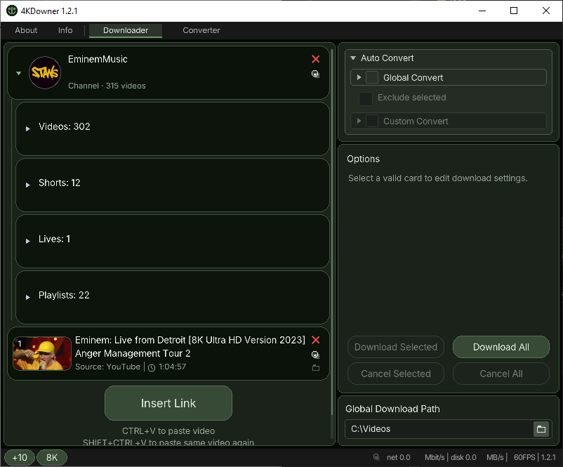

# 4KDowner

<p align="center">
  
</p>

Desktop app for downloading online video and converting media files on **Windows** and **Linux**.

Built with **C++17** and [raylib](https://www.raylib.com/). Downloads use [ytdown](https://github.com/epsill0n/ytdown); conversion uses [FFmpeg](https://ffmpeg.org/).

## Features

- Paste links and download in selectable quality (including 4K when available)
- Download queue with per-card progress and cancel
- More rounded preview frames on video, playlist, and channel cards
- Global / Custom Auto Convert after download (container, video, audio codecs)
- Separate Converter tab for local files
- Portable packages (ZIP on Windows, tar.gz on Linux)
- Windows MSI installer

## Requirements (build)

### Required: system CMake

Building requires a **system-installed CMake 3.20+** on `PATH` (package manager, Visual Studio C++ CMake tools, or [cmake.org](https://cmake.org/download/)).  
Do **not** rely on a portable/bundled CMake next to the repo — install CMake on the host:

```bash
# Arch / CachyOS
sudo pacman -S cmake

# Debian / Ubuntu
sudo apt install cmake

# Fedora
sudo dnf install cmake
```

On Windows, install CMake via the Visual Studio installer or from cmake.org, and ensure `cmake` is on `PATH`.

### Other build dependencies

- C++17 compiler (MSVC on Windows; `g++` or `clang++` on Linux)
- Sibling `packages/` folder next to this repo with:
  - `raylib`
  - `tinyfiledialogs`
  - (for running packaged builds) `ffmpeg`, `ytdown`, and `nodejs`

`packages/` can hold both Windows and Linux binaries side by side (for example `ffmpeg.exe` and `ffmpeg`). The app picks the native tools for the current OS.

Expected layout:

```text
Coding/
  4KDowner/          ← this repository
  packages/
    raylib/
    tinyfiledialogs/
    ffmpeg/
    ytdown/
    nodejs/
```

### Windows

- Windows 10/11 (x64)
- MSVC (Visual Studio Build Tools or Visual Studio)

### Linux

- x64 Linux with a working OpenGL stack (desktop/GPU drivers)
- Typical GUI/dev packages, for example on Debian/Ubuntu:

```bash
sudo apt install build-essential cmake libgl1-mesa-dev libx11-dev libxcursor-dev \
  libxinerama-dev libxrandr-dev libxi-dev libasound2-dev
```

At runtime you also need `ytdown`, `ffmpeg`, and a JS runtime (`packages/nodejs` or system Node) either on `PATH` or under `packages/` in the portable tree. Thumbnail fetch uses `curl` when available.

## Build

### Windows

```powershell
cmake -S . -B build-windows
cmake --build build-windows --config Release --target 4KDowner
```

Output: `build-windows/Release/4KDowner.exe` (or `build-windows/Debug/` for Debug).

### Linux

```bash
cmake -S . -B build-linux -DCMAKE_BUILD_TYPE=Release
cmake --build build-linux --target 4KDowner
```

Output: `build-linux/4KDowner`.

Run from a directory that can resolve `assets/` and `packages/` (the portable layout below, or the repo root after staging those folders).

## Packaging

Default Windows output folder (next to the repo under `yCompiled/`):

```text
Coding/
  4KDowner/
  yCompiled/
    4KDowner-<version>-windows-x64/          ← portable
    4KDowner-<version>-windows-x64.zip
    4KDowner-<version>-windows-x64.msi
    4KDowner-<version>-linux-x64/            ← portable (Linux)
    4KDowner-<version>-linux-x64.tar.gz
```

(`<version>` = `CMakeLists.txt` `project(… VERSION …)`.)

### Windows one-shot (`main.ps1`)

Builds Release, stages portable, zip, and MSI:

```powershell
.\scripts\Windows\main.ps1
```

Optional flags: `-SkipMsi`, `-SkipArchive`, `-EnsureYtDown`.

### Manual CMake targets

```bash
cmake --build build-windows --config Release --target package-portable   # Windows multi-config
cmake --build build-linux --target package-portable                      # Linux
cmake --build build-windows --config Release --target package-archive    # Windows
cmake --build build-linux --target package-archive                       # Linux
```

### Windows MSI only

Requires [WiX](https://wixtoolset.org/) CLI (`wix`):

```powershell
.\scripts\Windows\build-msi.ps1
.\scripts\Windows\build-msi.ps1 -RebuildPortable
```

One-time portable `ytdown` setup for packaging:

```powershell
.\scripts\Windows\setup-ytdown-portable.ps1
```

### Linux portable + archive

```bash
chmod +x scripts/Linux/main.sh
./scripts/Linux/main.sh
```

Output under `../yCompiled/` (same root as Windows):
- `4KDowner-<version>-linux-x64/` (portable folder)
- `4KDowner-<version>-linux-x64.tar.gz`

Optional: `--skip-archive`, `--ensure-ytdown`.

## License

4KDowner is licensed under the [GNU GPL v3](LICENSE).

Third-party license texts used by dependencies are in [`licenses/`](licenses/).
Emoji graphics default to [Noto Emoji](https://github.com/googlefonts/noto-emoji)-style PNGs (OFL): a frequent subset ships in `assets/emoji/noto/`; others download on demand into `Documents/4KDownerTemp/cache/emoji/`. Twemoji remains an alternate CDN-backed backend (not bundled).
